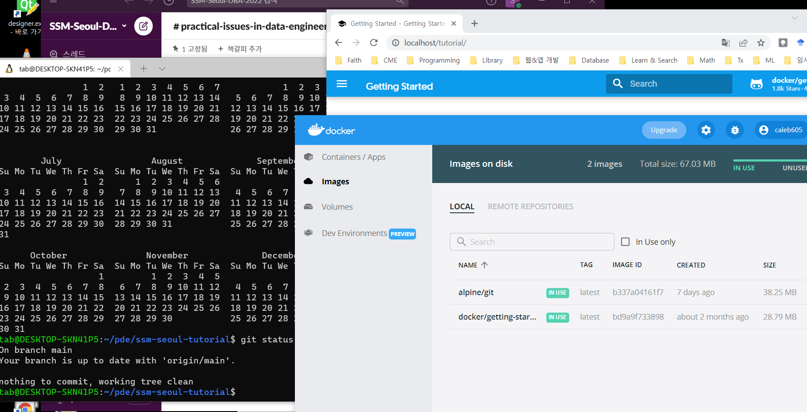

# Practical Issues in Data Engineering
## 실습환경 구축 후 이미지

## 2022-03-26 1일차 내용
### 실습환경 구축
* 링크참조 [[GitHub Page]](https://github.com/psyoblade/docker-for-dummies/tree/master/wsl)
 * 설치요류시 아래 내용 참고
   * Windows 재시작
   * WSL2 버전 업그레이드 [[Microsoft]](https://docs.microsoft.com/ko-kr/windows/wsl/install-manual#step-4---download-the-linux-kernel-update-package)
### 데이터 엔지니어링 소개
#### 목차
* 데이터 엔지니어링
* 데이터 엔지니어링의 역사
* Q&A

### Data Engineering
* '데이터 엔지니어링' 이란?
  * Data Scientist vs Data Engineer
    * "Data Scientist" 라는 직군은 여기에서는 아래의 직군(역할)을 통칭하여 일컫기로 함
      * System Engineer: 인프라, 네트워크, 시스템 및 플랫폼을 구축 
      * Data Engineer  : 시스템 아키텍처의 설계, 데이터의 수집, 가공 및 서비스를 위한 데이터 파이프라인의 설계 및 구축
      * Data Analysis  : 데이터를 모델링하고, 탐색하고, 예측 및 처방적인 분석을 수행
    * "Data Scientist"는 기업 내의 가치를 창출하고 서비스의 품질을 향상 시키기 위한 데이터 플랫폼의 설계, 구축 및 고도화를 위한 엔지니어라고 할 수 있음

### 데이터 엔지니어링의 역사
* 데이터 엔지니어링은 현재 Hadoop을 둘러싼 에코시스템의 발전으로 설명하여도 무리가 없을 것이다.
  * 참고 [MAD(Machine Learning, Artificial Intelligence, Data) Landscape 2021](http://46eybw2v1nh52oe80d3bi91u-wpengine.netdna-ssl.com/wp-content/uploads/2021/12/2021-MAD-Landscape-v3.pdf)
